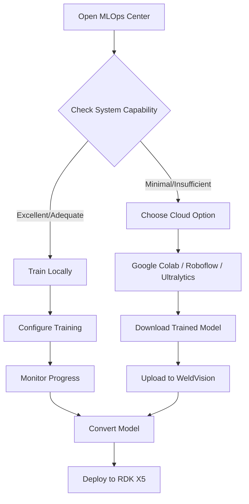

# Training Options for WeldVision-X5

## Overview

WeldVision-X5 now includes **automatic hardware capability detection** to help you choose the best training approach for your system. Training YOLOv8 models requires significant computational resources, especially GPU power.

## System Requirements Check

When you open the **MLOps Center**, the system automatically checks your hardware:

### Minimum Requirements
- **CPU**: 4+ cores
- **RAM**: 8GB minimum (16GB recommended)
- **GPU**: NVIDIA GPU with 6GB+ VRAM (highly recommended)

### Capability Levels

The system will classify your hardware into one of these categories:

#### ✅ Excellent
- 8+ CPU cores
- 16GB+ RAM
- NVIDIA GPU with 6GB+ VRAM
- **Recommendation**: Train locally with good performance

#### ⚠️ Adequate
- 4+ CPU cores
- 8-16GB RAM
- GPU with 4-6GB VRAM
- **Recommendation**: Can train locally but may be slower; use smaller batch sizes

#### ⚠️ Minimal
- Meets minimum CPU/RAM but **no GPU**
- **Recommendation**: CPU-only training is VERY slow (10-50x slower); strongly recommend cloud training

#### ❌ Insufficient
- Below minimum requirements
- **Recommendation**: Use cloud training services or import pre-trained models

## Training Workflow Options

### Option 1: Local Training (If System Meets Requirements)

If your system has adequate GPU resources:

```bash
1. Navigate to MLOps Center
2. Check the "System Training Capability" panel
3. If status is "Excellent" or "Adequate", proceed with local training
4. Select your dataset
5. Configure training parameters
6. Click "Start Training"
7. Monitor progress in the Jobs section
```

**Advantages:**
- Full control over training process
- No internet required
- Data privacy
- No usage limits

**Disadvantages:**
- Requires powerful hardware
- Consumes local resources
- May take hours on slower systems

---

### Option 2: Cloud Training (Recommended for Most Users)

#### 🌟 Google Colab (Recommended)
**Best for:** Students, beginners, free GPU access

**Features:**
- Free GPU (T4 or better)
- No setup required
- Jupyter notebook interface
- Can save models to Google Drive

**How to use:**
1. Go to [Google Colab](https://colab.research.google.com/)
2. Create new notebook
3. Enable GPU: Runtime → Change runtime type → GPU
4. Install YOLOv8:
   ```python
   !pip install ultralytics
   ```
5. Upload your dataset (or use Roboflow)
6. Train:
   ```python
   from ultralytics import YOLO
   model = YOLO('yolov8n.pt')
   results = model.train(data='path/to/data.yaml', epochs=50)
   ```
7. Download trained model (`best.pt`)
8. Upload to WeldVision-X5 MLOps → Convert → Deploy

**Limitations:**
- Session timeout after inactivity
- Limited GPU hours per week (free tier)
- Need to reconnect if session expires

---

#### 🤖 Roboflow Train
**Best for:** Automated workflow, no coding required

**Features:**
- Fully automated training
- Dataset hosting included
- Automatic augmentation
- Model performance metrics
- Free tier available

**How to use:**
1. Create account at [Roboflow](https://roboflow.com/)
2. Upload your annotated images
3. Generate dataset with train/val/test splits
4. Click "Train Model"
5. Select YOLOv8 architecture
6. Download trained model
7. Import to WeldVision-X5

**Pricing:**
- Free tier: Limited training hours
- Paid plans: $49+/month for unlimited training

---

#### 🚀 Ultralytics HUB
**Best for:** Official YOLOv8 platform, enterprise features

**Features:**
- Official Ultralytics service
- Cloud training on powerful GPUs
- Dataset versioning
- Model deployment tools
- Free tier available

**How to use:**
1. Sign up at [Ultralytics HUB](https://hub.ultralytics.com/)
2. Create new project
3. Upload dataset in YOLO format
4. Configure training settings
5. Start cloud training
6. Download model when complete
7. Import to WeldVision-X5

**Pricing:**
- Free tier: Limited resources
- Pro: $29/month
- Enterprise: Custom pricing

---

### Option 3: Import Pre-Trained Models

If you already have a trained YOLO model from another source:

**Supported formats:**
- PyTorch `.pt` files (YOLOv8)
- ONNX `.onnx` files
- Other YOLO formats (may require conversion)

**Import process:**
```bash
1. Go to MLOps Center
2. Click "Upload Model" or use file manager
3. Place .pt file in appropriate location
4. Use Convert Model feature to generate RDK X5 binary
5. Deploy to edge device
```

---

## Comparison Table

| Method | Cost | Speed | GPU Required | Difficulty | Best For |
|--------|------|-------|--------------|------------|----------|
| **Local Training** | Free | Fast | Yes | Medium | Users with gaming PC/workstation |
| **Google Colab** | Free | Fast | No (provided) | Easy | Students, learning, testing |
| **Roboflow** | Free/Paid | Fast | No (cloud) | Very Easy | Quick deployment, automation |
| **Ultralytics HUB** | Free/Paid | Fast | No (cloud) | Easy | Official support, enterprise |
| **Import Models** | Free | Instant | No | Easy | Already trained models |

---

## Recommendations by Use Case

### 👨‍🎓 Students / Learning
→ **Google Colab**
- Free GPU access
- Great for experimentation
- No hardware investment needed

### 🏭 Small Business / Prototyping
→ **Roboflow**
- Easiest workflow
- Automated everything
- Free tier to start

### 🏢 Enterprise / Production
→ **Ultralytics HUB** or **Local Training**
- Official support
- Data privacy (local)
- Scalable infrastructure

### 💰 Budget-Conscious
→ **Google Colab** → **Import to WeldVision**
- Completely free option
- Good performance
- Just takes a few extra steps

### ⚡ Already Have GPU
→ **Local Training**
- Full control
- No upload/download time
- Data stays local

---

## Technical Notes

### Why GPU is Critical for YOLO Training

YOLO models perform thousands of matrix operations during training. GPUs are optimized for this:

- **CPU training**: 10-50x slower than GPU
- **Example**: 50 epochs on CPU = 20+ hours vs 30 minutes on GPU
- **Memory**: GPUs have high-bandwidth memory for batch processing

### Minimum GPU Specifications

For efficient YOLOv8 training:
- **VRAM**: 6GB minimum (8GB recommended)
- **Examples of suitable GPUs**:
  - NVIDIA RTX 3060 (12GB)
  - NVIDIA RTX 3070 (8GB)
  - NVIDIA GTX 1660 Ti (6GB)
  - NVIDIA T4 (16GB - available on Colab)

### Batch Size Considerations

If you have limited VRAM:
- Reduce batch size (default: 16 → try 8 or 4)
- Use smaller model (yolov8n instead of yolov8m)
- Reduce image size (640 → 416)

---

## Workflow Summary



---

## Support & Troubleshooting

### System Check Shows Wrong Information
- Restart Docker containers: `docker-compose restart`
- Check if NVIDIA drivers are installed: `nvidia-smi`
- Verify GPU is visible to Docker

### Training Fails Immediately
- Check dataset format (YOLO format required)
- Verify data.yaml path is correct
- Ensure sufficient disk space (5GB+ recommended)
- Check Docker logs: `docker logs weldvision-backend`

### Cloud Training Questions
- **Colab**: See [Colab FAQ](https://research.google.com/colaboratory/faq.html)
- **Roboflow**: See [Roboflow Docs](https://docs.roboflow.com/)
- **Ultralytics**: See [Ultralytics Docs](https://docs.ultralytics.com/)

---

## Next Steps

1. ✅ Check your system capability in MLOps Center
2. ✅ Choose training method based on recommendation
3. ✅ Prepare your dataset (annotated images)
4. ✅ Train model (local or cloud)
5. ✅ Import/Convert model to RDK X5 format
6. ✅ Deploy to edge device
7. ✅ Monitor performance in Dashboard

For detailed deployment instructions, see [DEPLOYMENT.md](DEPLOYMENT.md)
